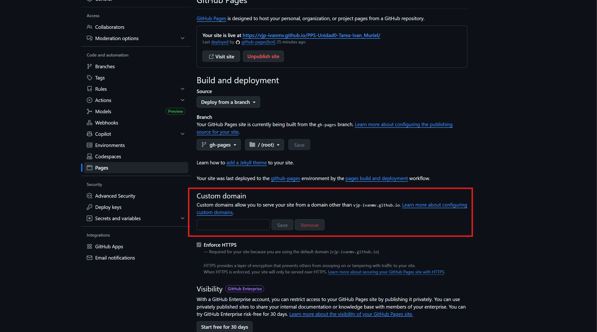
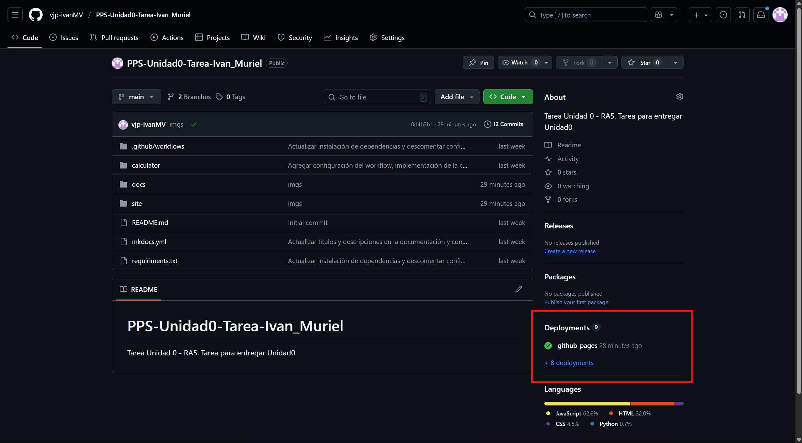
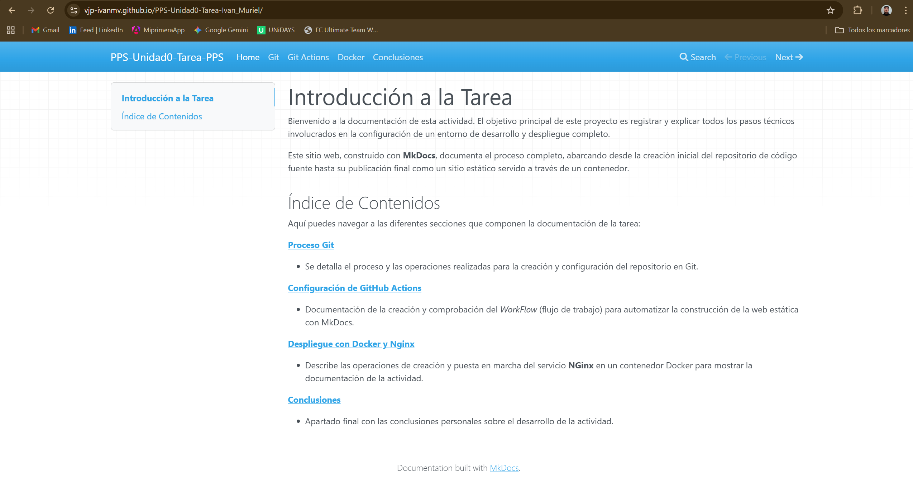

# Actividad Unidad 0 - gitPages

Esta documentación creada sobre el proyecto se creará en la rama `gh-pages` de nuestro repositorio y vamos a aprovechar para publicar esta docuemtación con `Git Pages`.  

**[Git Pages](https://docs.github.com/es/pages/getting-started-with-github-pages/what-is-github-pages)** GitHub Pages es un servicio de alojamiento web que permite a los usuarios de GitHub publicar sitios web estáticos (HTML, CSS, JavaScript) directamente desde un repositorio de Git, sin costo alguno. Es ideal para portafolios, blogs o páginas de proyectos, y no requiere experiencia previa en programación o servidores.

Uniendo esto con la sección gitActions, tenemos que cada vez que realizemos un `git push` en nuestro repositorio el workflow se va a disparar, haciendo que en nuestro equipo se construya la documentación HTML del proyecto en su rama `gh-pages` y a la vez es subida, junto a los cambios realizados en la rama main, al repositorio de github.  

Esta documentación la podremos visualizar a traves de `GitHub Pages`

1. **Activación de GitHub Pages:**

  Una vez que la *pipeline* se complete por primera vez, ve a **Settings** -> **Pages** en tu repositorio de GitHub y configura la fuente de despliegue a la rama **`gh-pages`** que la *pipeline* acaba de crear. Pulsamos el botón de `save` para que se guarden los cambios.

  

  Salimos para que se guarden los datos y tras unos minutos, en la sección de `Pages` tenemos:

  

1. **Verificación Final:**

    La documentación debería estar accesible en la URL de GitHub Pages ( ej. `https://Tu_usuario_github.github.io/<repositorio>/`).
    Podemos encontrarlo en **Deployments /Github pages** hacemos clic sobre ella y se mostrará el enlace para acceder a nuestra página web estática.

  

  
